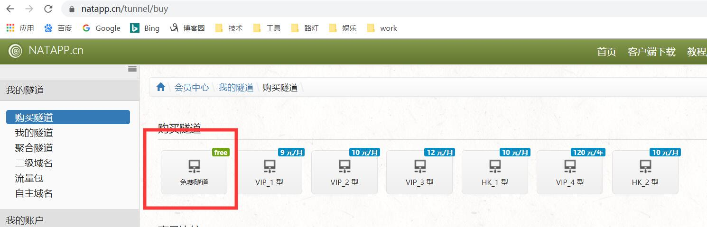
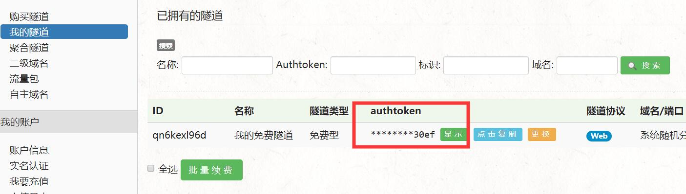
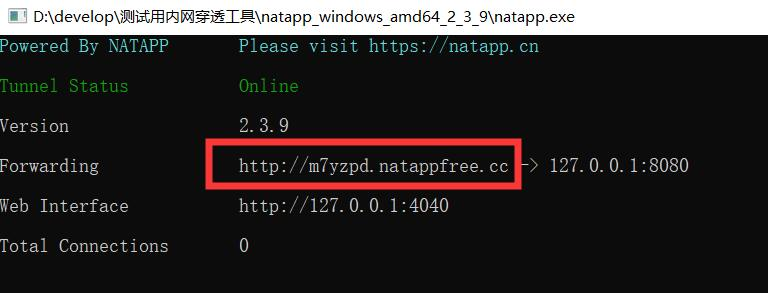

@author zhangye
@date 2019/12/20
@description 内网穿透工具使用方法

### NATAPP  快速上手

#### 注册账号

 https://natapp.cn/register

#### 免费购买

登录后,点击左边 购买隧道,免费即可–需要实名认证



点击免费隧道后 隧道协议为web 直接点击免费购买

#### 购买成功




重点内容

#### 下载natapp

在 natapp.cn 根据您的本机下载对应的客户端 https://natapp.cn/#download

下载之后,解压至任意目录,得到natapp.exe

**注意不要着急双击因为还有一步没配置**


#### 设置config.ini

下载或新建config.ini文件到刚才下载的natapp.exe同级目录  https://natapp.cn/article/config_ini

将图2中的authtoken填进去 最终文件如下 一般只需要填authtoken 其他空着即可

```
#将本文件放置于natapp同级目录 程序将读取 [default] 段
#在命令行参数模式如 natapp -authtoken=xxx 等相同参数将会覆盖掉此配置
#命令行参数 -config= 可以指定任意config.ini文件
[default]
authtoken=xxxxxxxxxxxxxxxx
clienttoken=
log=none
loglevel=ERROR
http_proxy=
```

#### 运行natapp

windows下,直接双击natapp.exe 即可

**图中红框内的url 为我们测试demo的内网穿透的url地址 注意每次运行natapp生成的url不同**



```
Tunnel Status Online 代表链接成功
Version 当前客户端版本,如果有新版本,会有提示
Forwarding 当前穿透 网址 或者端口
Web Interface 是本地Web管理界面,可在隧道配置打开或关闭,仅用于web开发测试
Total Connections 总连接数
```


